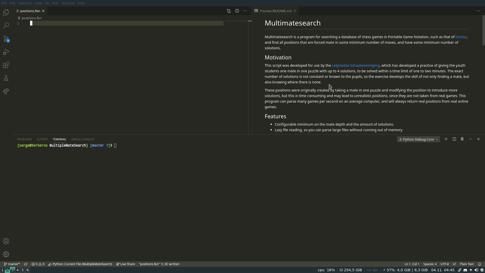

# Multimatesearch
Multimatesearch is a program for searching a database of chess games in Portable
Game Notation, such as that of [lichess](https://database.lichess.org/), and
find all positions that are forced mate in some minimum number of moves, and
have some minimum number of solutions.



## Motivation
This script was developed for use by the
[Lelystadse Schaakvereniging](http://lelystadseschaakvereniging.nl/), which has
developed a practice of giving the youth students one mate in one puzzle with up
to 4 solutions, to be solved within a time limit of one to two minutes. The
exact number of solutions is not constant or known to the pupils, so the
exercise develops the skill of not only finding a mate, but also knowing where
there is none.

These positions were originally created by taking a mate in one puzzle and
modifying the position to introduce more solutions, but this is time consuming
and may lead to unrealistic positions, since they are not taken from real games.
This program can parse many games per second on an average computer, and will
always return real positions from real online games.

## Features
* Configurable minimum on the mate depth and the amount of solutions.
* Lazy file reading, so you can parse large files without running out of
    memory.
* Adherance to the Unix style for tools, e.g. '-' can be substituted for a
    filename to read from stdin or write to stdout, and all messages (not
    output) are written to stderr.

## Known limitations
* If the depth of the mate is high, there is a chance that not every positions
    returned is not a forced mate in *fewer* moves. This is because stockfish
    at a low depth can miss some moves, including faster forced mates.

## Installation
Since multimatesearch is written in Python it doesn't need to be compiled.
Still, there are some external progams needed for notation conversion and
finding solutions. You'll need to install

* [stockfish](https://stockfishchess.org/)
* [pgn-extract](https://www.cs.kent.ac.uk/people/staff/djb/pgn-extract/)

Stockfish is widely known and available, and pgn-extract has its own
installation instruction on the website, but here is a quick overview for some
popular operating systems:

### Stockfish
* Ubuntu/Debian: `sudo apt-get install stockfish`
* Arch: `sudo pacman -S stockfish`
* Mac: `brew install stockfish`
* Windows: [Download](https://stockfishchess.org/download/) and install
    stockfish as a command line program.

### Pgn-extract
* Ubuntu/Debian: `sudo apt-get install pgn-extract`
* Arch: The package is in the
    [AUR](https://aur.archlinux.org/packages/pgn-extract/).
* Mac: The package does not seem to be on homebrew, but a
    [Makefile](https://en.wikipedia.org/wiki/Make_(software)) is included with
    the source code.
* Windows: Use the `.exe` provided on the project's site, or compile from
    source. When using the `.exe` locally, without installing it globally, make
    sure it's placed in a position where the program can find it.

## Usage
```
usage: multimatesearch [-h] [-o <file>] [-n <n>] [-m <mate>] [-q] [-t <threads>] file

Search a database of chess games for mate in m positions with at least n solutions.

positional arguments:
  file          The file containing all of the games that should be processed.

optional arguments:
  -h, --help    show this help message and exit
  -o <file>     place the output into <file> (default: positions.fen)
  -n <n>        only save positions with at least <n> different solutions (default: 2)
  -m <mate>     only save positions that are mate in <mate> (default: 1)
  -q, --quiet   run without informative output (default: False)
  -t <threads>  run stockfish accross <threads> different threads (default: 1)
```

## License
Multimatesearch is distributed under the
[MIT](https://choosealicense.com/licenses/mit/) license.
